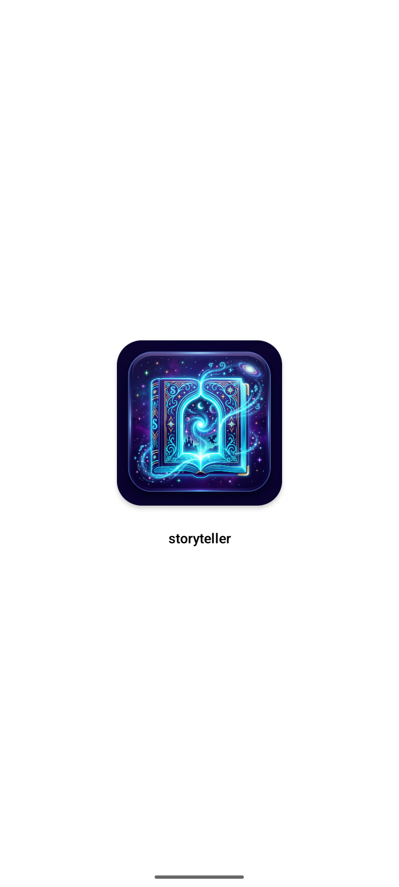
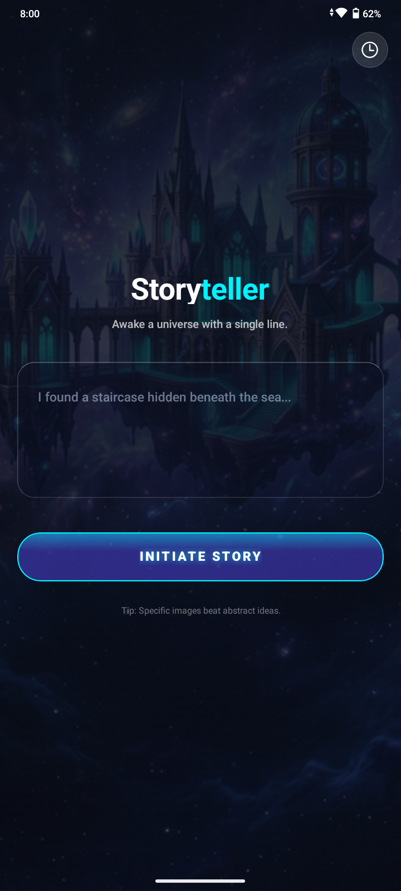
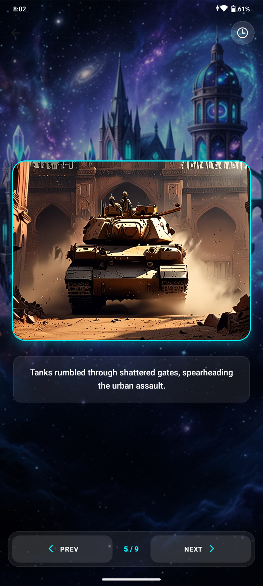
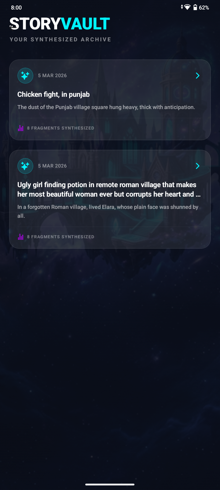

# Storyteller 🚀

<div align="center">


**Transform a single sentence into beautifully illustrated short stories using AI**

[](https://expo.dev/)
[](https://reactnative.dev/)
[](https://www.typescriptlang.org/)
[](LICENSE)

[Features](#-features) • [Screenshots](#-screenshots) • [Tech Stack](#-tech-stack) • [Installation](#-installation) • [Usage](#-usage) • [Architecture](#-architecture) • [API Documentation](#-api-documentation)

</div>

---

## 📖 Overview

**Storyteller** is an AI-powered mobile application that transforms your creative prompts into fully illustrated short stories. Built with React Native and Expo, it leverages Google Gemini AI for narrative generation and external image APIs for visual creation.

### How It Works

1. **Enter a seed sentence** (e.g., *"I found a staircase hidden beneath the sea..."*)
2. **AI generates a story** - 6-10 lines of narrative with custom image prompts
3. **Images are synthesized** - Each line gets a unique AI-generated illustration
4. **Stories are saved** - Browse your personal story archive anytime

---

## ✨ Features

### 🎨 Interactive Story Generation
- Enter any creative prompt to generate unique stories
- AI-powered narrative engine using Google Gemini 2.5 Flash
- Each story contains 6-10 distinct, vivid lines
- Automatic image prompt generation for each line

### 🖼️ Real-time Visual Enhancement
- Custom image generation for every story segment
- Intelligent image caching with 7-day TTL
- Smooth slideshow navigation between scenes
- Neural network-powered scene synthesis
- Base64 image encoding and storage

### 📚 Personal Story Archive Management
- SQLite-powered local database
- Browse all previously generated stories
- Auto-cleanup keeps history at 50 entries max
- Image cache capped at 100 images
- Quick access to revisit any story

### 🎨 Cross-platform User Interface
- Beautiful "liquid glass" design language
- Semi-transparent backgrounds with native blur effects
- Neon accent colors (cyan, purple, pink)
- Smooth Reanimated transitions and gestures
- Haptic feedback on all user interactions
- Dark mode primary theme

---

## 📸 Screenshots

### Splash Screen
<p align="center">
  
</p>

### Landing Screen - Story Input
<p align="center">
  
</p>

### Story Viewer - Image Slideshow
<p align="center">
  
</p>

### History Screen - Story Archive
<p align="center">
  
</p>

---

## 🛠️ Tech Stack

> ⚠️ **IMPORTANT: Version Compatibility Warning**
> 
> This application is specifically configured to work with the exact package versions listed below. **Using newer versions may break the app** due to breaking changes in React Native, Expo, or dependency APIs. Upgrading requires dedicated code refactoring to align with updated dependencies. Proceed with caution and test thoroughly if updating any packages.

### Core Framework & Runtime
| Technology | Version | Purpose |
|------------|---------|---------|
| **React Native** | 0.81.5 | Cross-platform mobile framework |
| **React** | 19.1.0 | UI component library |
| **Expo** | ~54.0.33 | Development platform and tooling |
| **TypeScript** | ~5.9.3 | Type-safe JavaScript superset |

### Navigation & Routing
| Package | Version | Purpose |
|---------|---------|---------|
| `expo-router` | ~6.0.23 | File-based routing system |
| `@react-navigation/native` | ^7.1.33 | Navigation container |
| `@react-navigation/bottom-tabs` | ^7.15.5 | Tab navigation |
| `@react-navigation/drawer` | ^7.9.4 | Drawer navigation |
| `@react-navigation/elements` | ^2.9.10 | Navigation UI components |
| `react-native-screens` | ~4.16.0 | Native navigation primitives |
| `react-native-safe-area-context` | ~5.6.2 | Safe area handling |

### UI Components & Styling
| Package | Version | Purpose |
|---------|---------|---------|
| `nativewind` | ^4.2.2 | Tailwind CSS for React Native |
| `tailwindcss` | ^3.4.19 | Utility-first CSS framework |
| `expo-glass-effect` | ~0.1.9 | Native blur/glass morphism effects |
| `expo-linear-gradient` | ~15.0.8 | Gradient backgrounds |
| `@expo/vector-icons` | ^15.1.1 | Icon library (Ionicons, etc.) |
| `expo-image` | ~3.0.11 | Optimized image rendering |
| `expo-font` | ~14.0.11 | Custom font loading |
| `expo-constants` | ~18.0.13 | App configuration constants |

### Animations & Gestures
| Package | Version | Purpose |
|---------|---------|---------|
| `react-native-reanimated` | ~4.1.6 | Smooth 60fps animations |
| `react-native-gesture-handler` | ~2.28.0 | Touch gesture handling |
| `react-native-worklets` | 0.5.1 | Worklet-based threading |

### Data Storage & Persistence
| Package | Version | Purpose |
|---------|---------|---------|
| `expo-sqlite` | ~16.0.10 | Local SQLite database |
| `@react-native-async-storage/async-storage` | 2.2.0 | Key-value async storage |

### AI & API Integration
| Package | Version | Purpose |
|---------|---------|---------|
| `@google/genai` | ^1.44.0 | Google Gemini AI SDK |
| `dotenv` | ^17.3.1 | Environment variable management |

### Development & Build Tools
| Package | Version | Purpose |
|---------|---------|---------|
| `eslint` | ^9.39.3 | Code linting |
| `eslint-config-expo` | ~10.0.0 | Expo ESLint config |
| `prettier-plugin-tailwindcss` | ^0.5.14 | Prettier Tailwind formatting |
| `expo-splash-screen` | ~31.0.13 | Splash screen configuration |
| `expo-system-ui` | ~6.0.9 | System UI customization |

### Additional Expo Modules
| Package | Version | Purpose |
|---------|---------|---------|
| `expo-haptics` | ~15.0.8 | Haptic feedback |
| `expo-linking` | ~8.0.11 | Deep linking support |
| `expo-web-browser` | ~15.0.10 | In-app web browser |
| `expo-symbols` | ~1.0.8 | SF Symbols support |
| `react-dom` | 19.1.0 | Web platform support |
| `react-native-web` | ~0.21.2 | React Native for web |

---

## 📦 Installation

### Prerequisites

Before you begin, ensure you have the following installed:
- **Node.js** (v18 or higher) - [Download](https://nodejs.org/)
- **npm**, **yarn**, or **bun** - Package managers
- **Expo CLI** - Install with `npm install -g expo-cli`
- **iOS Simulator** (Mac only) or **Android Emulator**

### Step-by-Step Installation

#### 1. Clone the Repository

```bash
git clone https://github.com/animeshsrivastava246/storyteller.git
cd storyteller
```

#### 2. Install Dependencies

Using **npm**:
```bash
npm install
```

Using **bun** (recommended):
```bash
bun install
```

#### 3. Configure Environment Variables

Create a `.env` file in the project root:

```bash
# Google GenAI API key for story generation
GOOGLE_GENAI_API_KEY=your_gemini_api_key_here

# Image generation API endpoint
IMG_API_URL=https://your-image-api-endpoint.com/generate

# Bearer token for image API authentication
IMG_API_TOKEN=your_bearer_token_here
```

**How to get API keys:**
- **Google GenAI API Key**: Visit [Google AI Studio](https://aistudio.google.com/app/apikey)
- **Image API**: Configure your preferred image generation service (Stability AI, DALL-E, Midjourney, etc.)

#### 4. Start the Development Server

```bash
npm start
# or
expo start
# or
bun run start
```

This will launch the Expo development server and display a QR code.

#### 5. Run on Your Device

**Option A: Physical Device (Recommended)**
- Install **Expo Go** app from:
  - iOS: [App Store](https://apps.apple.com/app/expo-go/id982107779)
  - Android: [Play Store](https://play.google.com/store/apps/details?id=host.exp.exponent)
- Scan the QR code from the terminal

**Option B: iOS Simulator (Mac only)**
```bash
npm run ios
# or
expo start --ios
```

**Option C: Android Emulator**
```bash
npm run android
# or
expo start --android
```

**Option D: Web Browser**
```bash
npm run web
# or
expo start --web
```

---

## 🚀 Usage

### Basic Workflow

1. **Launch the app** - You'll see the landing screen with a glass-morphism input card

2. **Enter your seed sentence** - Type a creative prompt like:
   - *"I discovered a hidden door in my apartment..."*
   - *"The last tree on Earth began to glow..."*
   - *"A message arrived from 100 years in the future..."*

3. **Generate the story** - Tap **"Initiate Story"** button
   - The AI will generate a 6-10 line narrative
   - Each line includes a custom image prompt

4. **View the story** - Navigate through scenes:
   - Swipe or tap **Prev/Next** buttons
   - Each scene shows text + generated image
   - Progress indicator shows current position

5. **Browse history** - Tap the history icon (top-right):
   - View all saved stories
   - Tap any story to re-read
   - Stories auto-managed (max 50 entries)

### Advanced Tips

- **Be specific**: Detailed prompts generate better images than abstract ideas
- **Visual language**: Use concrete imagery ("red castle") over concepts ("freedom")
- **Scene breaks**: Each line should describe a distinct visual moment
- **Retry failed images**: If image generation fails, tap "Retry" button

---

## 🏗️ Architecture

### Project Structure

```
storyteller/
├── app/                          # Expo Router screens and API routes
│   ├── api/                      # Server-side API routes (+api.ts convention)
│   │   ├── story+api.ts         # POST: generates story via Google Gemini
│   │   └── image+api.ts         # POST: generates images via external API
│   ├── _layout.tsx              # Root Stack navigator layout
│   ├── index.tsx                # Home screen with seed input
│   ├── story.tsx                # Story viewer with image slideshow
│   └── history.tsx              # Modal showing saved stories
│
├── components/                   # Reusable UI components
│   ├── icons/                   # SVG icon components
│   ├── HeaderIconButton.tsx     # Glass-styled icon button for headers
│   └── StoryCard.tsx            # Glass-styled story preview card
│
├── theme/                        # Design system tokens
│   ├── tokens.ts                # Colors, spacing, typography tokens
│   ├── primitives.ts            # Reusable style objects
│   └── index.ts                 # Theme exports
│
├── types/                        # Shared TypeScript types
│   └── story.ts                 # StoryLine, StoryEntry interfaces
│
├── utils/                        # Utility modules
│   ├── apiClient.ts             # API client and hooks
│   ├── database.ts              # SQLite database setup and migrations
│   ├── env.server.ts            # Server-side environment config
│   ├── history.ts               # Story history CRUD operations
│   └── imageCache.ts            # Image caching layer with TTL
│
├── assets/                       # Static assets
│   ├── icons/                   # App icons
│   ├── images/                  # Splash screens, favicons
│   └── chateau.jpeg             # Background image
│
├── local_assets/                 # Documentation screenshots
│   ├── splashScreen.png
│   ├── landingScreen.png
│   ├── story.png
│   └── history.png
│
├── .env                          # Environment variables (not committed)
├── .env.example                  # Example environment file
├── app.json                      # Expo configuration
├── package.json                  # Node dependencies
├── tsconfig.json                 # TypeScript configuration
├── tailwind.config.js            # Tailwind CSS configuration
├── babel.config.js               # Babel configuration
└── metro.config.js               # Metro bundler configuration
```

### Data Flow Diagram

```
┌─────────────┐
│   User      │
└──────┬──────┘
       │
       ▼
┌─────────────────────────────────────────┐
│  Index Screen (Seed Input)              │
│  - TextInput                            │
│  - Generate Button                      │
└──────────────┬──────────────────────────┘
               │
               ▼
┌─────────────────────────────────────────┐
│  POST /api/story                        │
│  - Validates environment                │
│  - Calls Google Gemini AI               │
│  - Returns { story: [{text, prompt}] }  │
└──────────────┬──────────────────────────┘
               │
               ▼
┌─────────────────────────────────────────┐
│  Save to Database (SQLite)              │
│  - stories table                        │
│  - Utils: history.ts                    │
└──────────────┬──────────────────────────┘
               │
               ▼
┌─────────────────────────────────────────┐
│  Story Screen                           │
│  - Display story lines                  │
│  - Request images for each prompt       │
└──────────────┬──────────────────────────┘
               │
               ▼
┌─────────────────────────────────────────┐
│  POST /api/image                        │
│  - Check image_cache first              │
│  - Call external image API if missing   │
│  - Cache result for 7 days              │
└──────────────┬──────────────────────────┘
               │
               ▼
┌─────────────────────────────────────────┐
│  Display Images                         │
│  - Slide show navigation                │
│  - Prev/Next controls                   │
│  - Loading states                       │
└─────────────────────────────────────────┘
```

### Database Schema

#### **stories** Table
```sql
CREATE TABLE IF NOT EXISTS stories (
  id TEXT PRIMARY KEY,           -- Unique story ID (UUID)
  seed TEXT NOT NULL,            -- Original user prompt
  created_at TEXT NOT NULL,      -- ISO timestamp
  story_json TEXT NOT NULL       -- JSON-serialized StoryLine array
);

CREATE INDEX IF NOT EXISTS idx_stories_created_at
ON stories(created_at DESC);
```

#### **image_cache** Table
```sql
CREATE TABLE IF NOT EXISTS image_cache (
  prompt_hash TEXT PRIMARY KEY,  -- MD5 hash of image prompt
  image_data TEXT NOT NULL,      -- Base64-encoded image data
  created_at TEXT NOT NULL       -- Unix timestamp
);

CREATE INDEX IF NOT EXISTS idx_image_cache_created_at
ON image_cache(created_at DESC);
```

### Key Design Patterns

- **Path Alias**: `@/*` maps to project root for clean imports
- **API Routes**: Expo Router's `+api.ts` convention for server-side endpoints
- **Environment Variables**: Server-side env loaded via `utils/env.server.ts` using dotenv
- **Shared Types**: Centralized in `types/story.ts` for type safety across client/server
- **Data Persistence**: All data stored via SQLite (expo-sqlite)
- **Haptic Feedback**: On all user interactions via `expo-haptics`
- **Animations**: Reanimated with spring physics for smooth motion

---

## 🔌 API Documentation

### Story Generation Endpoint

**URL**: `POST /api/story`

**Description**: Generates a short story from a seed sentence using Google Gemini AI.

**Request Body**:
```json
{
  "seed": "I found a staircase hidden beneath the sea..."
}
```

**Response** (Success - 200 OK):
```json
{
  "story": [
    {
      "text": "The ancient steps spiraled down into darkness.",
      "prompt": "Underwater stone staircase descending into dark ocean depths, bioluminescent glow, photorealistic, 4K"
    },
    {
      "text": "Bioluminescent creatures lit the way forward.",
      "prompt": "Glowing jellyfish and exotic fish illuminating underwater ruins, vibrant colors"
    }
  ]
}
```

**Response** (Error - 400 Bad Request):
```json
{
  "error": "Missing 'seed' in request body"
}
```

**Response** (Error - 500 Internal Server Error):
```json
{
  "error": "GOOGLE_GENAI_API_KEY is not set in environment"
}
```

---

### Image Generation Endpoint

**URL**: `POST /api/image`

**Description**: Generates an image from a text prompt using an external image API.

**Request Body**:
```json
{
  "prompt": "Underwater stone staircase descending into dark ocean depths"
}
```

**Response** (Success - 200 OK):
```json
{
  "imgUrl": "data:image/jpeg;base64,/9j/4AAQSkZJRgABAQEAYABgAAD..."
}
```

**Prompt Enhancement**:
The API automatically enhances prompts with:
- ". A high-resolution, highly detailed, professional image"
- "vibrant colors and intricate details"
- "Make the image 4:3 aspect ratio"

**Response** (Error - 400 Bad Request):
```json
{
  "error": "Prompt is required!"
}
```

**Response** (Error - 502 Bad Gateway):
```json
{
  "error": "Image API error: Connection timeout"
}
```

---

## ⚙️ Configuration

### Environment Variables

| Variable | Description | Required | Example |
|----------|-------------|----------|---------|
| `GOOGLE_GENAI_API_KEY` | Google Gemini AI API key | ✅ Yes | `AIzaSyD...` |
| `IMG_API_URL` | Image generation API endpoint | ✅ Yes | `https://api.stability.ai/v1/generation/...` |
| `IMG_API_TOKEN` | Bearer token for image API | ✅ Yes | `sk-...` |

### Build Configuration

#### **app.json** - Expo Configuration

Key settings:
```json
{
  "expo": {
    "name": "storyteller",
    "slug": "storyteller",
    "version": "1.0.0",
    "orientation": "portrait",
    "newArchEnabled": true,
    "ios": {
      "supportsTablet": true
    },
    "android": {
      "adaptiveIcon": {
        "backgroundColor": "#E6F4FE"
      },
      "edgeToEdgeEnabled": true
    },
    "web": {
      "bundler": "metro",
      "output": "server"
    },
    "plugins": [
      "expo-router",
      "expo-sqlite",
      "expo-font"
    ]
  }
}
```

#### **babel.config.js** - Babel Configuration

Enables React Compiler and NativeWind:
```javascript
module.exports = function (api) {
  api.cache(true);
  return {
    presets: [
      ["babel-preset-expo", { jsxImportSource: "nativewind" }],
      "nativewind/babel",
    ],
    plugins: [
      ["react-compiler", {}]
    ],
  };
};
```

#### **tailwind.config.js** - Tailwind Configuration

Custom theme colors and design tokens:
```javascript
/** @type {import('tailwindcss').Config} */
module.exports = {
  content: ["./app/**/*.{js,jsx,ts,tsx}", "./components/**/*.{js,jsx,ts,tsx}"],
  presets: [require("nativewind/preset")],
  theme: {
    extend: {
      colors: {
        "neon-cyan": "#00F3FF",
        "neon-purple": "#BD00FF",
        "neon-pink": "#FF0080",
      },
      textShadow: {
        "neon-cyan": "0 0 10px rgba(0, 243, 255, 0.8)",
      },
    },
  },
  plugins: [],
};
```

---

## 🧪 Development Commands

| Command | Description |
|---------|-------------|
| `npm start` | Start Expo development server |
| `npm run android` | Start on Android device/emulator |
| `npm run ios` | Start on iOS simulator |
| `npm run web` | Start in web browser |
| `npm run lint` | Run ESLint code analysis |
| `npm run clean` | Clean install (removes node_modules, .expo, reinstalls) |

### Debugging

**Using Flipper**:
```bash
npm start
# Press 'd' to open Dev Menu
# Select "Open Debugger" → Flipper
```

**Remote JS Debugging**:
- Shake device or press `Cmd+D` (iOS) / `Cmd+M` (Android)
- Select "Debug" option
- Chrome DevTools will open

**Inspecting Database**:
```bash
# Locate database file
~/Library/Developer/CoreSimulator/Devices/<DEVICE_ID>/data/Containers/Data/Application/<APP_ID>/Documents/Expo/SQLite/storyteller.db
```

---

## 🤝 Contributing

Contributions are welcome! Please follow these steps:

1. **Fork the repository**
   ```bash
   git fork https://github.com/animeshsrivastava246/storyteller
   ```

2. **Create a feature branch**
   ```bash
   git checkout -b feature/amazing-feature
   ```

3. **Make your changes**
   - Follow existing code style
   - Add tests if applicable
   - Update documentation

4. **Commit your changes**
   ```bash
   git commit -m "Add amazing feature"
   ```

5. **Push to the branch**
   ```bash
   git push origin feature/amazing-feature
   ```

6. **Open a Pull Request**
   - Describe your changes
   - Reference any related issues
   - Wait for CI checks to pass

### Code Style

- **Linting**: ESLint with Expo config
- **Formatting**: Prettier with Tailwind plugin
- **Type Safety**: TypeScript strict mode
- **Naming**: PascalCase for components, camelCase for functions

---

## 📄 License

This project is licensed under the MIT License. See [LICENSE](LICENSE) for details.

---

## 🙏 Acknowledgments

- **Google Gemini AI** - Narrative generation powered by Gemini 2.5 Flash
- **Expo Team** - For the amazing React Native development platform
- **React Native Community** - Continuous improvements and support
- **Image API Providers** - Stability AI, DALL-E, or other image generation services

---

## 📞 Support

For issues, questions, or contributions:
- **GitHub Issues**: [Report a bug](https://github.com/animeshsrivastava246/storyteller/issues)
- **Discussions**: [Feature requests](https://github.com/animeshsrivastava246/storyteller/discussions)
- **Email**: Contact via GitHub profile

---

<div align="center">

**Made with 💙 and AI magic**

**[Back to Top](#storyteller-)**

</div>
